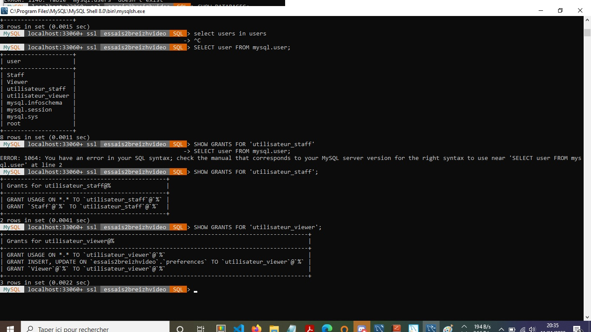

***Création d'une base de données à partir de la base Sequila***

 1. la base de données et la génération de son schéma dans le script *essais2breizhvideo.sql*
 2. le copie des données depuis Sequila se fait grâce au script *insert into breizhVideo.sql*
 3. la création des utilisateurs se fait grâce au dernier script. 

*La vérification par la mysql shell :*

